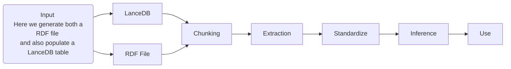

# Architecture Flow

TODOs:
- [X] The generated graph needs to connect to the lance resources via the named graph holding the ID generated in the source phase with lance which is currently just, Add an 'id' column by creating a SHA256 hash of the filename. Should this be the file contents?
- [ ] Ensure the lexical graph connects in with a similar approach as the RDF graph.  Convert the gliner output via RML to a graph.  Need to ensure the graph has an id (based on the filename hash) and then make RML map the graph to the RDF graph.
- [ ] add in the AI-based entity resolution elements from coffee code
- [ ] using the JSON-LD input, generate some examples and SHACL shaped leveraging the OGC Building blocks (https://github.com/opengeospatial/bblock-template).  
- [ ] use these shapes and example SPARQL as elements of the context engineering
- [ ] align with mapping goals in CODATA - CDIF
- [ ] OPTIONAL: explore prompt generation via DSpy with these examples.  
- [X] add a chainlit UI example 
- [X] modify the gradio code to be an MCP server and connect with chainlit
- [ ] Add in a table to parquet function. 
- [ ] Could also add in a simple FTS and vector search on a table


## Notes

Overview document for some of the basic AI testing being done.

One thing to note in this work.   We are leveraging both vector RAG and graph RAG.
This is due to the following observations.

Vector search (VectoRAG) is good at
   * small "s" semantics
   * natural language context, but it lacks precision.

Conversely, Knowledge Graphs are

   * Deterministic and Accurate; big S semantics
   * Support inference and validation
   * Support more than just "similarity" with multi-path relations (motifs)

## JSON-LD collection

This code is for working with the JSON-LD collection of resources.  To do the indexing of resources at the start
there are various approaches.  One approach is to use 
the Gleaner software stack described at https://gleaner.io.

## Command snippets


#### For generating the input files

```bash
python masterControl.py jsonld2lance --json_dir ./stores/input/ --db_path ./stores/lance/db --table_name source
```

```bash
python masterControl.py gliner2lance --db_path ./stores/lance/db --source_table source --output_table entities
```

```bash
python masterControl.py jsonld2ntfile --input_dir ./stores/input/ --output_file ./stores/sourceinput.nt
```

#### Lance inspection commands

```bash
python masterControl.py lance_list --db_path ./stores/lance/db 
```

```bash
python masterControl.py lance_head --db_path ./stores/lance/db --table_name sources --n 10  
```

#### For reindexing and running Qlever

```bash
qlever -q Qleverfile get-data  
 ```

```bash
qlever -q Qleverfile index --overwrite-existing
```

```bash
qlever -q Qleverfile start 
 ```

```bash
qlever -q Qleverfile ui 
 ```

## Stages

1) Input
   * JSON-LD to LanceDB (jsonld2lance)
   * JSON-LD to NT and triplestore (jsonld2ntfile)
   * Conversion from various formats to some set of input formats like Markdown (jsonld2md)
2) Chunk & embedding
   * Chonkie to lance (chonkie2lance)
3) Extraction
   * Gliner for ER and RE  (gliner2lance)
4) Standardize
   * TBD
5) Inference
   * TBD
6) Use
   * Gradio
   * Chainlit
7) Deployment
   * MCP server for lance


## The flow



1) Input
    * Conversion from various formats to some set of input formats like Markdown
       * Tooling: docling / pymupdf / fitz
       * Store: LanceDB
    * JSON-LD to NT and triplestore
2) Chunk & embedding
   * Chunking strategies such as semantic and late chunking, the later being the one used in these examples.  For this section I am looking at the use of [docling chunking](https://docling-project.github.io/docling/examples/advanced_chunking_and_serialization/) vs [Chonkie](https://docs.chonkie.ai/python-sdk/chunkers/overview).
       * Tooling: Chonkie
       * Store: LanceDB
3) Extraction
    * SPO triples and other ER RE approaches leveraging LLMs based approaches
      * Tooling: [Gliner](https://github.com/urchade/GLiNER) BAML
        * https://huggingface.co/collections/knowledgator/gliner-biomed-67ecf1b7cc62e673dbc8b57f
      * Store: LanceDB
4) Standardize
    * Vocabulary and entity alignment
      * Tooling: KuzuDB (property graph) Qlever (RDF)
      * Store: Native graph storage
5) Inference
    * inferred relations (deferred step for now, see Inference Ready KG in ai.md)
6) Use
    *  Analysis, leverage in search and discovery, potentially using high-level approaches like motifs and subgraph centrality
    * Tooling:
      * Gradio
      * FastMCP
      * FastAgent
      * [BAML RAG](https://docs.boundaryml.com/examples/prompt-engineering/retrieval-augmented-generation)
      * Gemini CLI example via MCP to demonstrate the same stuff being done in the RAG example.

## User interface

All this UI code is older versions that don't run with the 
current MCP and services endpoints.   I have the updated versions
in a private repo that I will port over to here.  

### Chainlit

This code base needs to be updated to use the latest version from the coffeecode repo.  Also, it leverage the MCP server exposing the triplestore.   Qlever in our case.  


## Docling Notes

TBD

### References
  * https://docling-project.github.io/docling/examples/hybrid_chunking/
  * https://docling-project.github.io/docling/examples/advanced_chunking_and_serialization/
  * https://docling-project.github.io/docling/examples/rag_haystack/
