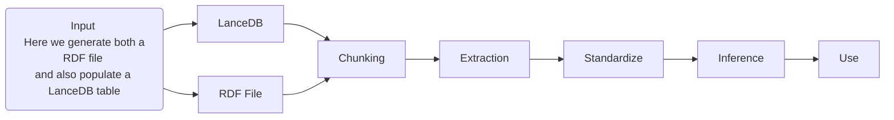

# Architecture Flow

## Notes

Overview document for some of the basic AI testing being done.

One thing to note in this work.   We are leveraging both vector RAG and graph RAG.
This is due to the following observations.

Vector search (VectoRAG) is good at
   * small "s" semantics
   * natural language context, but it lacks precision.

Conversely, Knowledge Graphs are

   * Deterministic and Accurate; big S semantics
   * Support inference and validation
   * Support more than just "similarity" with multi-path relations (motifs)

TODOs:
- [ ] add in the ai based entity resolution elements from coffe code

## Command snippets


#### For generating the input files

```bash
python masterControl.py jsonld2lance --json_dir ./stores/input/ --db_path ./stores/lance/db --table_name source
```

```bash
python masterControl.py gliner2lance --db_path ./stores/lance/db --source_table source --output_table entities
```

```bash
python masterControl.py jsonld2ntfile --input_dir ./stores/input/ --output_file ./stores/sourceinput.nt
```


#### For reindexing and running Qlever

```bash
qlever -q Qleverfile get-data  
 ```

```bash
qlever -q Qleverfile index --overwrite-existing
```

```bash
qlever -q Qleverfile start 
 ```

```bash
qlever -q Qleverfile ui 
 ```


## The flow



1) Input
    * Conversion from various formats to some set of input formats like Markdown
       * Tooling: docling / pymupdf / fitz
       * Store: LanceDB
    * JSON-LD to NT and triplestore
2) Chunk & embedding
   * Chunking strategies such as semantic and late chunking, the later being the one used in these examples.  For this section I am looking at the use of [docling chunking](https://docling-project.github.io/docling/examples/advanced_chunking_and_serialization/) vs [Chonkie](https://docs.chonkie.ai/python-sdk/chunkers/overview).
       * Tooling: Chonkie
       * Store: LanceDB
3) Extraction
    * SPO triples and other ER RE approaches leveraging LLMs based approaches
      * Tooling: [Gliner](https://github.com/urchade/GLiNER) BAML
        * https://huggingface.co/collections/knowledgator/gliner-biomed-67ecf1b7cc62e673dbc8b57f
      * Store: LanceDB
4) Standardize
    * Vocabulary and entity alignment
      * Tooling: KuzuDB (property graph) Qlever (RDF)
      * Store: Native graph storage
5) Inference
    * inferred relations (deferred step for now, see Inference Ready KG in ai.md)
6) Use
    *  Analysis, leverage in search and discovery, potentially using high-level approaches like motifs and subgraph centrality
    * Tooling:
      * Gradio
      * FastMCP
      * FastAgent
      * [BAML RAG](https://docs.boundaryml.com/examples/prompt-engineering/retrieval-augmented-generation)
      * Gemini CLI example via MCP to demonstrate the same stuff being done in the RAG example.

## Docling Notes

### References
  * https://docling-project.github.io/docling/examples/hybrid_chunking/
  * https://docling-project.github.io/docling/examples/advanced_chunking_and_serialization/
  * https://docling-project.github.io/docling/examples/rag_haystack/
