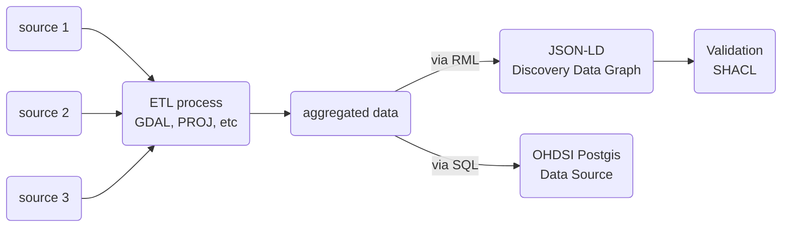
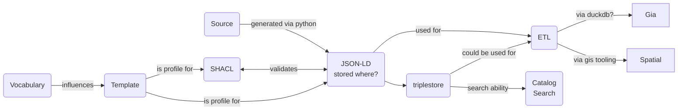

# CDIF Mapping

## Notes

- [ ] need an approach to express the RML pipeline (link to the RML GitHub raw URL) and further information
- [ ] need to add a link to the RML mapping file
- [ ] represent

__example validation command__
```bash
pyshacl -s https://smrgeoinfo.github.io/OCGbuildingBlockTest/_sources/properties/identifier/rules.shacl -sf turtle -df json-ld -f table reference1.json
```


## Elements related to the CDIF mapping process



Sources: These are geospatial, census and other data sources that are used to generate the integrated data.

ETL: A set of ETL codes that are used to generate the aggregated data.

RML and SQL: These are used to generate the JSON-LD documents and 
populate the OHDSI Postgis database.

CDIF is looking at approaches to express these processes in a declarative way in JSON-LD.  This is a work in progress.


### Example ETL codes


``` 
# this shows all variables that need normalization
$ curl "http://10.141.251.21:3000/rpc/gdsc_get_attributes" -X POST -H "Content-Type: application/json" -d '{"tablename":"public.acs_2021_5yr_tract_12_florida_dvmt","lat":25.7577,"lng":-80.2329,"identifier":"geoid","attrs":["persons_4_years_old_and_younger","age_of_5_and_19","persons_between_the_age_of_20_and_64","persons_65_years_old_and_over","white_alone","black_or_african_american_alone","american_indian_and_alaska_native_alone","asian_alone","pacific_islander","some_other_race","two_or_more_races","hispanic_or_latino__any_race","white_alone__not_hispanic_or_latino","high_school_degree__ged_or_lower","some_college__no_degree","associates_degree","bachelors_degree","graduate_professional_degree","armed_forces_veterans","total_number_of_disabled_residents","total_snap_recipients","medicare_recipients","total_medicaid_recipients"],"normal":"total_population"}'
--OR--
http://10.141.251.21:3000/rpc/gdsc_get_attributes?tablename=public.acs_2021_5yr_tract_12_florida_dvmt&lat=25.718&lng=-80.279&identifier=geoid&attrs={persons_4_years_old_and_younger,age_of_5_and_19,persons_between_the_age_of_20_and_64,persons_65_years_old_and_over,white_alone,black_or_african_american_alone,american_indian_and_alaska_native_alone,asian_alone,pacific_islander,some_other_race,two_or_more_races,hispanic_or_latino__any_race,white_alone__not_hispanic_or_latino,high_school_degree__ged_or_lower,some_college__no_degree,associates_degree,bachelors_degree,graduate_professional_degree,armed_forces_veterans,total_number_of_disabled_residents,total_snap_recipients,medicare_recipients,total_medicaid_recipients}&normal=total_population
--expected output--
[{"geoid":"12086980300","persons_4_years_old_and_younger":0.00000000000000000000,"age_of_5_and_19":0.60042060988433228181,"persons_between_the_age_of_20_and_64":0.39852786540483701367,"persons_65_years_old_and_over":0.00105152471083070452,"white_alone":0.78801261829652996845,"black_or_african_american_alone":0.09484752891692954784,"american_indian_and_alaska_native_alone":0.00042060988433228181,"asian_alone":0.09442691903259726604,"pacific_islander":0.00000000000000000000,"some_other_race":0.00273396424815983176,"two_or_more_races":0.01955835962145110410,"hispanic_or_latino__any_race":0.12134595162986330179,"white_alone__not_hispanic_or_latino":0.67360672975814931651,"high_school_degree__ged_or_lower":0.00315457413249211356,"some_college__no_degree":0.00925341745531019979,"associates_degree":0.00525762355415352261,"bachelors_degree":0.00252365930599369085,"graduate_professional_degree":0.00147213459516298633,"armed_forces_veterans":0.00210304942166140904,"total_number_of_disabled_residents":0.07928496319663512093,"total_snap_recipients":0.00000000000000000000,"medicare_recipients":0.01598317560462670873,"total_medicaid_recipients":0.08454258675078864353}]

# this shows all variables that do not need normalization
$ curl "http://10.141.251.21:3000/rpc/gdsc_get_attributes" -X POST -H "Content-Type: application/json" -d '{"tablename":"public.acs_2021_5yr_tract_12_florida_dvmt","lat":25.7577,"lng":-80.2329,"identifier":"geoid","attrs":["aggregate_household_income","total_housing_units","median_income_of_residents","residents_below_poverty_level","total_housing_units","total_single_family_houses","total_duplex_multiple_units__less_than_10_units","number_of_housing_structures_with_10_19_units","number_of_housing_structures_with_20_49_units","number_of_housing_structures_with_50_or_more_units","housing_tenancy__owner_occupied_housing_units","housing_tenancy__renter_occupied_housing_units"],"normal":""}'
--OR--
http://10.141.251.21:3000/rpc/gdsc_get_attributes?tablename=public.acs_2021_5yr_tract_12_florida_dvmt&lat=25.718&lng=-80.279&identifier=geoid&attrs={aggregate_household_income,total_housing_units,median_income_of_residents,residents_below_poverty_level,medicare_recipients,total_medicaid_recipients,total_housing_units,total_single_family_houses,total_duplex_multiple_units__less_than_10_units,number_of_housing_structures_with_10_19_units,number_of_housing_structures_with_20_49_units,number_of_housing_structures_with_50_or_more_units,housing_tenancy__owner_occupied_housing_units,housing_tenancy__renter_occupied_housing_units}&normal=
-- expected output --
[{"geoid":"12086980300","aggregate_household_income":null,"total_housing_units":6,"median_income_of_residents":6,"residents_below_poverty_level":33,"medicare_recipients":76,"total_medicaid_recipients":402,"total_housing_units":6,"total_single_family_houses":0,"total_duplex_multiple_units__less_than_10_units":6,"number_of_housing_structures_with_10_19_units":0,"number_of_housing_structures_with_20_49_units":0,"number_of_housing_structures_with_50_or_more_units":0,"housing_tenancy__owner_occupied_housing_units":0,"housing_tenancy__renter_occupied_housing_units":6}]
```


## Example Relations in the data activity flow




* Vocabulary: This is any domainm or upper level ontology or other vocabulary.  These influence the development of the template
* Template [example1.json](../graphs/example1.json)
* The template is then a guide for the ```SHACL``` validation shapes, the ```generated via python``` between the Source and JSON-LD collection.  Reference: [README.md](../graphs/shapegraphs/README.md) 
* In this case ```SOURCE``` is any material that is being used to generate JSON-LD based metadata for the catalog
* ```JSONLD``` is the collection of the generated JSON-LD documents algined with the ```Template``` and validated via the ```SHACL``` 
* It is possible to load the JSON-LD into a ```triplestore``` to all for graph-based search of even graph analytics.
* ```ETL``` is the process by the JSON-LD can be leveraged to load into other indexes like ```Gia``` or ```Spatial``` indexes.  For example, something like DuckDB ([duckIt.py](../duckIt.py)) can be used to do this.
