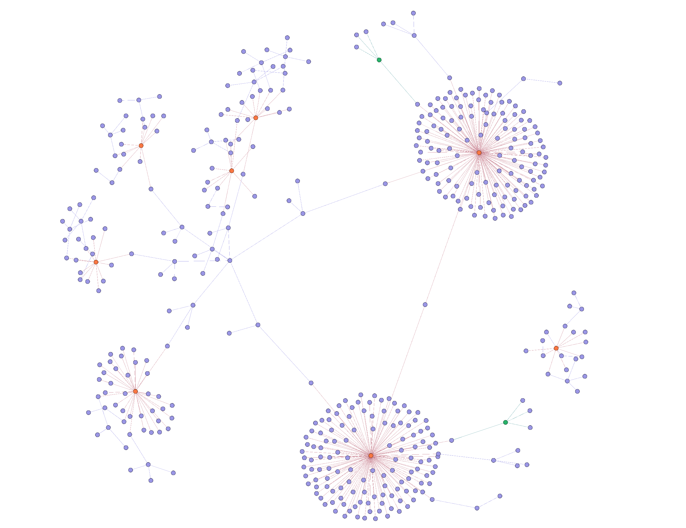

# Notebooks


## About


## Notes

need to read in the JSON-LD from these files

```
../datastore/data/global_pm25_concentration_1998_2016/meta_json-ld_global_pm25_concentration_1998_2016.json
../datastore/data/ma_2018_svi_tract/meta_json-ld_ma_2018_svi_tract.json
../datastore/data/tz_1984_copernicus_avg_temp/meta_json-ld_tz_1984_copernicus_avg_temp.json
../datastore/data/us_2018_svi_county/meta_json-ld_us_2018_svi_county.json
../datastore/data/tz_2022_nbs/tz_2022_nbs_districts/meta_json-ld_tz_2022_nbs_districts.json
../datastore/data/tz_2022_nbs_magu_district/meta_json-ld_tz_2022_nbs_magu_district.json
../datastore/data/tz_magu_dem_srtm/meta_json-ld_tz_magu_dem_srtm.json
../datastore/data/tz_populated_places_osm/meta_json-ld_tz_populated_places_osm.json
../datastore/data/tz_regions_osm/meta_json-ld_tz_regions_osm.json

```


Example graph in Gephi




Example from Sigma

